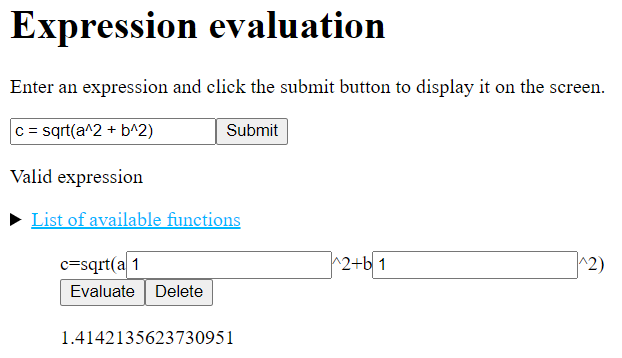

# Overview
This is a program that evaluates mathematical expressions. On the web browser, the user can enter an expression and display it on the screen. The result can then be obtained after assigning the values to all the variables.

# Requirements
- Node.js
- Express.js
- Pug
- mathjs

